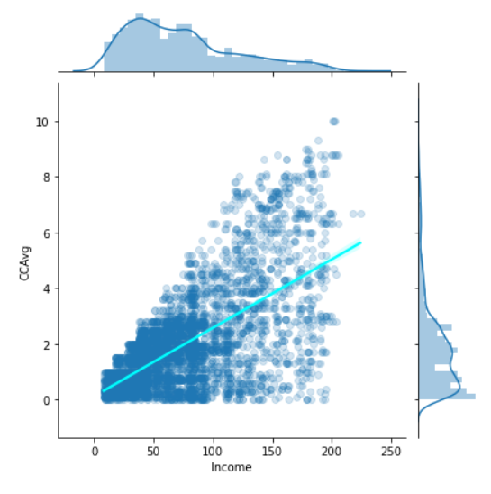

Marketing Campaign for Banking Products
==================

__by Shubham Anand__

---

## Table of contents
* [Introduction](#introduction)
* [Data](#data)
* [Analysis](#analysis)
* [Results and Discussion](#results)
* [Conclusion](#conclusion)

## Introduction<a name="introduction"></a>
---

<font size="4">The main notebook for this project can be found here: <a href='https://github.com/dark-crusader/ml-banking-customer-classification/blob/master/Main.ipynb' target=_blank>Main.ipynb</a>.</font>

<font size="3"><strong>Aim Of the Notebook:</strong></font>
<ul>
    <li>Uderstand The Problem Statement</li>
    <li>Import and Comprehend the Dataset</li>
    <li>Data Preprocessing and Exploratory Data Analysis</li>
    <li>Training a Logistic Regression Model for Prediction</li>
    <li>Model Evaluation</li>
    <li>Use Various Classification Algorithms and their Evaluation</li>
    <li>Drawing Conclusions</li>
</ul>

<font size="3">__Problem Statement__</font>

The bank has a growing customer base. The bank wants to increase borrowers (asset
customers) base to bring in more loan business and earn more through the interest on
loans. So , the bank wants to convert the liability based customers to personal loan
customers. (while retaining them as depositors). A campaign that the bank ran last year
for liability customers showed a healthy conversion rate of over 9% success. The
department wants you to build a model that will help them identify the potential
customers who have a higher probability of purchasing the loan. This will increase the
success ratio while at the same time reduce the cost of the campaign.

<font size="3">__Objective__</font>

The goal is to predict the likelihood of a liability customer buying personal loans.

The problem statement reduces to binary classification

## Data sources<a name="data"></a>

---

The project uses the <a target=_blank href="https://www.kaggle.com/itsmesunil/bank-loan-modelling">Bank Loan Modelling</a> Dataset from Kaggle.

The Dataset Comprises of 5000 tuples and 14 attributes.

__<font size="3">Information on the features or attributes</font>__

__The binary category have five variables as below:__

* __Personal Loan__ - Did this customer accept the personal loan offered in the last campaign? This is our __target variable__
* __Securities Account__ - Does the customer have a securities account with the bank?
* __CD Account__ - Does the customer have a certificate of deposit (CD) account with the bank?
* __Online__ - Does the customer use internet banking facilities?
* __Credit Card__ - Does the customer use a credit card issued by UniversalBank?

__Interval variables are as below:__

* __Age__ - Age of the customer
* __Experience__ - Years of experience
* __Income__ - Annual income in dollars
* __CCAvg__ - Average credit card spending
* __Mortage__ - Value of House Mortgage

__Ordinal Categorical Variables are:__

* __Family__ - Family size of the customer
* __Education__ - education level of the customer

__The nominal variable is :__

* __ID__
* __Zip Code__

## Data cleaning
---


<font size="3">__Loaded Dataset__</font>


<font size="3">__Dataset Summary__</font>


We see that Experience has a minimum value of -3 which is invalid. We will fix this.

<font size="3">__Checking for null values__</font>


## Analysis <a name="analysis"></a>
---

__<font size="4"> Exploratory Data Analysis</font>__

The following is the correlation matrix for the data


We dropped ID column from the dataframe as it serves no purpose in model prediction

We will also drop Experience form dataframe as it has a very high correlation with Age

We then take care of non binary categorical variables.

We use one hot encoding for Education to Divide it into Undergraduate, Graduate and Professional

As for ZIP Codes they can serve a purpose so we encode them using target encoder

The following is the final dataframe head after these operations


We then plot distribution plots for all continuous variables

__Age dist plot__


__Income dist plot__


__Credit Cared Spending dist plot__


__Mortgage dist plot__


We see that the data is highly skewed thus we apply log transform to the data
---

__Log Age dist plot__


__Log Income dist plot__


__Log Credit Card Spending dist plot__


__Log Mortgage dist plot__


Bivariate Analysis
---

__Income vs. Age hexplot__


__Family v. Income Boxplot (Hue on weather taken personal loan)__


Regression plot Income vs. Credit Card Spending



Scatter Plot for Income vs. Mortgage


## Results and Discussion <a name="results"></a>
___

The following are the Confusion Martix and ROC Curves for the models which were trained
---

Notice: The following Confusion Matrices were evaluated for models with their default threshold.

But because the Business Model requires that we aim to include all potential customers, the confusion matrix in the Main.ipynb files have been evaluated for models with a lower threshold

The ROC Curves although will remain the same as they are not dependent on change in thresholds for a model.

In fact the primary use of ROC Curves is find a suitable threshold for a model based on the precison - recall tradeoff we are willing to make.

* __Logistic Regression Model__


* __K Nearest Neighbour__


* __Naive Bayes__


* __Decision Tree__


Lastly, we see a plot which shows the impact different variables make in Decision Tree Classifier


__For detailed analysis read the Main.ipynb Jupyter notebook__

_Regards_

_Shubham Anand_


```python

```
